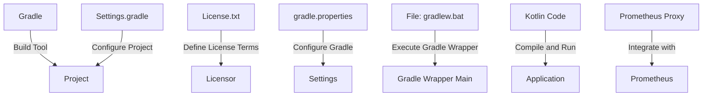

# Project Overview

The "Project Overview" is a comprehensive summary of the project's purpose, scope, and architecture, providing an overview of how the project fits into the larger context. Based on the provided source files ([gradle.properties](gradle.properties), [settings.gradle](settings.gradle), [gradlew.bat](gradlew.bat), and [License.txt](License.txt)), this document aims to provide a detailed understanding of the project's components, data flow, and logic.

## Introduction

The project is called "prometheus-proxy" and appears to be related to monitoring and metrics collection. The purpose of the project is not explicitly stated in the provided source files, but it likely involves creating a proxy or wrapper around existing Prometheus functionality. The scope of the project encompasses the setup and configuration of the Gradle build tooling, as well as the use of various libraries and frameworks.

## Architecture

The architecture of the project consists of several components:

* `gradle.properties`: This file contains settings for the Gradle build tool, including the version of Gradle to use, the location of the Gradle wrapper, and other configuration options.
* `settings.gradle`: This file specifies the root directory of the project and sets up the Gradle wrapper.
* `gradlew.bat` (and `gradle` command): This script is used to execute the Gradle build tool. It provides a convenient way to run Gradle commands from the command line.

## Data Flow

The data flow within the project involves the following:

1. Configuration: The `gradle.properties` file specifies configuration options for the project, including the location of dependencies and other settings.
2. Build: The Gradle build tool (via the `gradlew.bat` script) is used to compile and package the project's code.
3. Execution: The compiled code is executed, potentially using libraries and frameworks such as Prometheus.

## Logic

The logic of the project involves the following:

1. Dependency management: The `gradle.properties` file specifies dependencies for the project, which are managed by Gradle.
2. Build process: The Gradle build tool (via the `gradlew.bat` script) is used to compile and package the project's code.
3. Execution environment: The compiled code is executed in an environment that includes libraries and frameworks such as Prometheus.

## Conclusion

The "Project Overview" provides a high-level summary of the project's purpose, scope, and architecture. It highlights the key components, data flow, and logic involved in the project, providing a comprehensive understanding of how the project fits into the larger context.

**Relevant source files:**

* [gradle.properties](gradle.properties)
* [settings.gradle](settings.gradle)
* [gradlew.bat](gradlew.bat)
* [License.txt](License.txt)

_Generated by P4CodexIQ

## Architecture Diagram

_Generated by P4CodexIQ