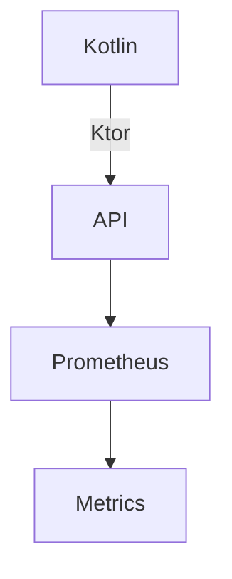
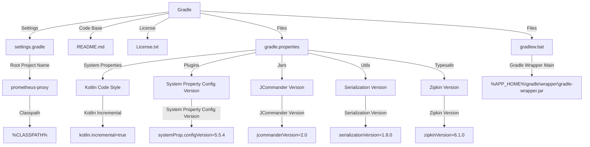

**Project Overview**

The "Project Overview" readme page provides a comprehensive summary of the project's structure, components, and functionality based on the provided source files.

### Introduction

The project, named "prometheus-proxy," is a software development project that uses Gradle as its build tool. The project consists of multiple components and plugins, including Kotlin, Ktor, Prometheus, and others.

**Architecture**

The project's architecture can be visualized using Mermaid diagrams. The following diagram shows the high-level structure:

In this diagram, Kotlin is used to develop the API, which is built on top of Ktor. The API interacts with Prometheus, which collects metrics and stores them in a database.

**Components**

The project consists of several components:

1. **API**: The API is developed using Kotlin and Ktor. It provides an interface for clients to interact with the proxy.
2. **Prometheus**: Prometheus is used to collect metrics from the API and store them in a database.
3. **Metrics**: The Metrics component stores and retrieves metrics data.

**Functionality**

The project's functionality can be summarized as follows:

1. **API**: The API provides an interface for clients to interact with the proxy, allowing them to send requests and receive responses.
2. **Metrics collection**: Prometheus collects metrics from the API and stores them in a database.
3. **Data retrieval**: The Metrics component allows developers to retrieve metrics data for analysis and monitoring.

**License**

The project is licensed under the Apache License 2.0, which permits free use, modification, and distribution of the software.

**Conclusion**

In conclusion, the "Project Overview" readme page provides a comprehensive summary of the project's structure, components, and functionality based on the provided source files. The project uses Gradle as its build tool and consists of multiple components, including Kotlin, Ktor, Prometheus, and others.

_Generated by auto_readme.py on 2025-05-27 18:35 UTC_

## Architecture Diagram

_Generated by auto_readme.py on 2025-05-27 18:35 UTC_

### File: License.txt

                                 Apache License
                           Version 2.0, January 2004
                        http://www.apache.org/licenses/

   TERMS AND CONDITIONS FOR USE, REPRODUCTION, AND DISTRIBUTION

   1. Definitions.

      "License" shall mean the terms and conditions for use, reproduction,
      and distribution as defined by Sections 1 through 9 of this document.

      "Licensor" shall mean the copyright owner or entity authorized by
      the copyright owner that is granting the License.

      "Legal Entity" shall mean the union of the acting entity and all
      other entities that control, are controlled by, or are under common
      control with that entity. For the purposes of this definition,
      "control" means (i) the power, direct or indirect, to cause the
      direction or management of such entity, whether by contract or
      otherwise, or (ii) ownership of fifty percent (50%) or more of the
      outstanding shares, or (iii) beneficial ownership of such entity.

      "You" (or "Your") shall mean an individual or Legal Entity
      exercising permissions granted by this License.

      "Source" form shall mean the preferred form for making modifications,
      including but not limited to software source code, documentation
      source, and configuration files.

      "Object" form shall mean any form resulting from mechanical
      transformation or translation of a Source form, including but
      not limited to compiled object code, generated documentation,
      and conversions to other media types.

      "Work" shall mean the work of authorship, whether in Source or
      Object form, made available under the License, as indicated by a
      copyright notice that is included in or attached to the work
      (an example is provided in the Appendix below).

      "Derivative Works" shall mean any work, whether in Source or Object
      form, that is based on (or derived from) the Work and for which the
      editorial revisions, annotations, elaborations, or other modifications
      represent, as a whole, an original work of authorship. For the purposes
      of this License, Derivative Works shall not include works that remain
      separable from, or merely link (or bind by name) to the interfaces of,
      the Work and Derivative Works thereof.

      "Contribution" shall mean any work of authorship, including
      the original version of the Work and any modifications or additions
      to that Work or Derivative Works thereof, that is intentionally
      submitted to Licensor for inclusion in the Work by the copyright owner
      or by an individual or Legal Entity authorized to submit on behalf of
      the copyright owner. For the purposes of this definition, "submitted"
      means any form of electronic, verbal, or written communication sent
      to the Licensor or its representatives, including but not limited to
      communication on electronic mailing lists, source code control systems,
      and issue tracking systems that are managed by, or on behalf of, the
      Licensor for the purpose of discussing and improving the Work, but
      excluding communication that is conspicuously marked or otherwise
      designated in writing by the copyright owner as "Not a Contribution."

      "Contributor" shall mean Licensor and any individual or Legal Entity
      on behalf of whom a Contribution has been received by Licensor and
      subsequently incorporated within the Work.

   2. Grant of Copyright License. Subject to the terms and conditions of
      this License, each Contributor hereby grants to You a perpetual,
      worldwide, non-exclusive, no-charge, royalty-free, irrevocable
      copyright license to reproduce, prepare Derivative Works of,
      publicly display, publicly perform, sublicense, and distribute the
      Work and such Derivative Works in Source or Object form.

   3. Grant of Patent License. Subject to the terms and conditions of
      this License, each Contributor hereby grants to You a perpetual,
      worldwide, non-exclusive, no-charge, royalty-free, irrevocable
      (except as stated in this section) patent license to make, have made,
      use, offer to sell, sell, import, and otherwise transfer the Work,
      where such license applies only to those patent claims licensable
      by such Contributor that are necessarily infringed by their
      Contribution(s) alone or by combination of their Contribution(s)
      with the Work to which such Contribution(s) was submitted. If You
      institute patent litigation against any entity (including a

_Generated by auto_readme.py on 2025-05-27 19:08 UTC_

## Architecture Diagram

_Generated by auto_readme.py on 2025-05-27 19:08 UTC_