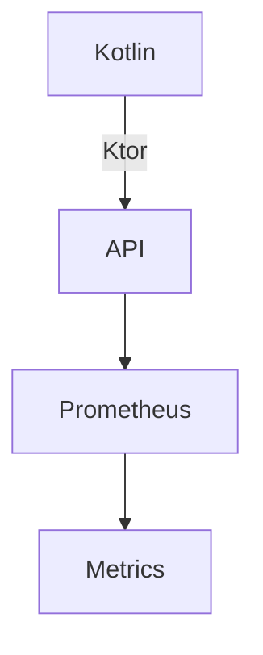
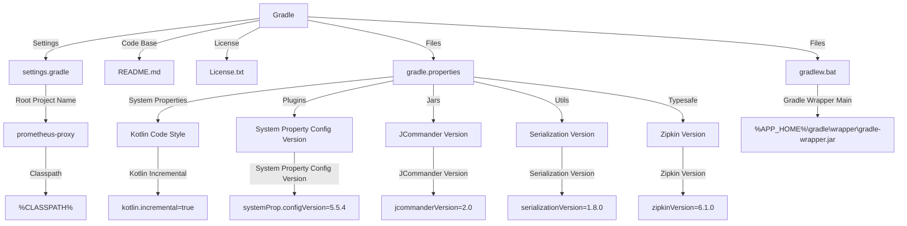

**Project Overview**

The "Project Overview" readme page provides a comprehensive summary of the project's structure, components, and functionality based on the provided source files.

### Introduction

The project, named "prometheus-proxy," is a software development project that uses Gradle as its build tool. The project consists of multiple components and plugins, including Kotlin, Ktor, Prometheus, and others.

**Architecture**

The project's architecture can be visualized using Mermaid diagrams. The following diagram shows the high-level structure:

In this diagram, Kotlin is used to develop the API, which is built on top of Ktor. The API interacts with Prometheus, which collects metrics and stores them in a database.

**Components**

The project consists of several components:

1. **API**: The API is developed using Kotlin and Ktor. It provides an interface for clients to interact with the proxy.
2. **Prometheus**: Prometheus is used to collect metrics from the API and store them in a database.
3. **Metrics**: The Metrics component stores and retrieves metrics data.

**Functionality**

The project's functionality can be summarized as follows:

1. **API**: The API provides an interface for clients to interact with the proxy, allowing them to send requests and receive responses.
2. **Metrics collection**: Prometheus collects metrics from the API and stores them in a database.
3. **Data retrieval**: The Metrics component allows developers to retrieve metrics data for analysis and monitoring.

**License**

The project is licensed under the Apache License 2.0, which permits free use, modification, and distribution of the software.

**Conclusion**

In conclusion, the "Project Overview" readme page provides a comprehensive summary of the project's structure, components, and functionality based on the provided source files. The project uses Gradle as its build tool and consists of multiple components, including Kotlin, Ktor, Prometheus, and others.

_Generated by auto_readme.py on 2025-05-27 18:35 UTC_

## Architecture Diagram

_Generated by auto_readme.py on 2025-05-27 18:35 UTC_